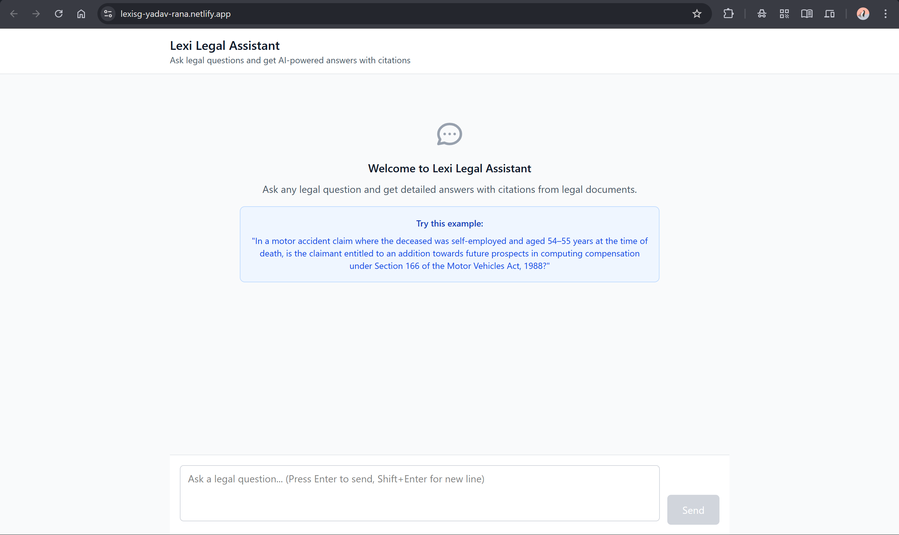
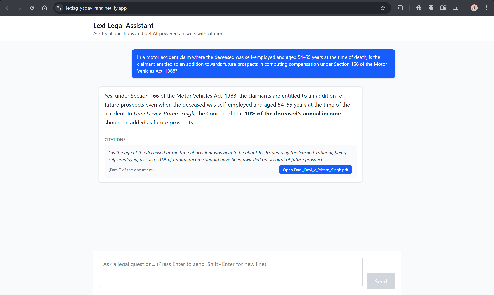
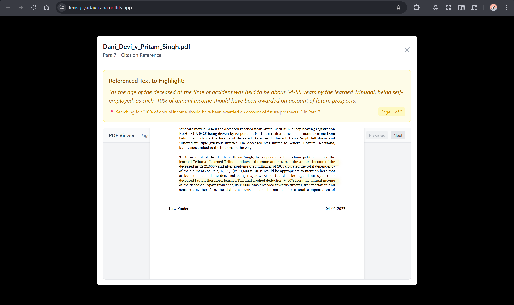

# Lexi Legal Assistant - Frontend Interface

A modern, ChatGPT-like interface for a legal assistant that provides AI-generated answers with citations from legal documents.

## Features

- **Chat Interface**: Clean, modern chat interface similar to ChatGPT
- **Legal Q&A**: Ask legal questions and receive detailed answers
- **Citations**: View citations from legal documents with source references
- **PDF Integration**: Click citations to view PDF documents in modal popup
- **Responsive Design**: Works on desktop and mobile devices
- **Keyboard Shortcuts**: Press Enter to send, Shift+Enter for new line
- **Auto-scroll**: Automatically scrolls to new messages (not working how it is intended to for now)
- **Loading States**: Visual feedback during message processing

## Tech Stack

- **React 18** - Frontend framework
- **Vite** - Build tool and dev server
- **Tailwind CSS** - Utility-first CSS framework
- **Modern JavaScript** - ES6+ features

## Getting Started

### Prerequisites

- Node.js (version 16 or higher)
- npm or yarn

### Installation

1. Clone the repository:

```bash
git clone https://github.com/Yadav-Rana/Lexisg-frontend-intern-test.git
cd Lexisg-frontend-intern-test
```

2. Install dependencies:

```bash
npm install
```

3. Start the development server:

```bash
npm run dev
```

4. Open your browser and navigate to `http://localhost:5173` (or the port shown in terminal)

## Usage

1. **Ask a Question**: Type your legal question in the text area at the bottom
2. **Send Message**: Press Enter or click the Send button
3. **View Answer**: The AI assistant will provide a detailed answer with legal reasoning
4. **Check Citations**: Click on citation buttons to view source documents
5. **Open PDFs**: Citations link to actual legal documents for verification

### Example Question

Try asking this sample question:

```
"In a motor accident claim where the deceased was self-employed and aged 54–55 years at the time of death, is the claimant entitled to an addition towards future prospects in computing compensation under Section 166 of the Motor Vehicles Act, 1988? If so, how much?"
```

## Citation Handling

The application implements a sophisticated citation linking system that allows users to trace AI-generated legal answers back to their original source documents. Here's how citation linking was handled:

### 1. Citation Data Structure

Each citation contains:

- **Text**: The exact quoted text from the legal document
- **Source**: The PDF filename (e.g., "Dani_Devi_v_Pritam_Singh.pdf")
- **Paragraph**: Reference to specific paragraph (e.g., "Para 7")
- **PDF URL**: Local path to the PDF file for viewing
- **Highlight Text**: Specific text to search and highlight within the PDF

### 2. Citation Display

- Citations appear below each AI answer in dedicated gray cards
- Each citation shows the quoted text in italics
- Source information displays the paragraph reference and document name
- A blue "Open [filename]" button provides direct access to the PDF

### 3. PDF Integration with React-PDF

The application uses **react-pdf** library for seamless PDF viewing:

- **PDF.js Worker**: Configured to use local worker file (`/pdf.worker.min.js`)
- **Modal Interface**: Full-screen modal popup for PDF viewing
- **Page Navigation**: Previous/Next buttons and direct page input
- **Loading States**: Visual feedback during PDF loading

### 4. Smart Citation Linking

When a citation is clicked, the system:

- **Estimates Starting Page**: Calculates likely page based on paragraph number (assumes 2-3 paragraphs per page)
- **Opens PDF Modal**: Displays the PDF with navigation controls
- **Highlights Citation Text**: Automatically searches for and highlights the referenced text
- **Provides Context**: Shows the citation text above the PDF for reference

### 5. Text Search and Highlighting

(\*This is not exactly working how it is intended to but does the job done for now)

Advanced text highlighting features:

- **Automatic Search**: Searches for citation text when PDF loads
- **Visual Highlighting**: Yellow background with pulsing animation for found text
- **Multiple Match Handling**: Highlights all instances of the citation text
- **Best Match Detection**: Special highlighting for the most relevant match
- **CSS Animations**: Smooth highlighting effects with keyframe animations

### 6. User Experience Features

- **Responsive Design**: Modal adapts to different screen sizes
- **External Link**: Option to open PDF in new tab if modal viewing fails
- **Error Handling**: Graceful fallback when PDF fails to load
- **Search Indicators**: Shows what text is being searched and on which page
- **Page Counter**: Displays current page and total pages

### 7. Technical Implementation

The citation linking system is built with:

- **React Hooks**: `useState` and `useEffect` for state management
- **Event Handlers**: `handleCitationClick()` for processing citation clicks
- **PDF Events**: `onDocumentLoadSuccess()` and `onDocumentLoadError()` for PDF handling
- **Search Algorithm**: `searchAndHighlightText()` for finding and highlighting text
- **CSS Animations**: Custom keyframe animations for highlighting effects

## Project Structure

```
src/
├── App.jsx          # Main application component
├── App.css          # Custom styles
├── index.css        # Tailwind CSS imports
└── main.jsx         # Application entry point
```

## API Simulation

The application uses simulated API responses for demonstration purposes. In a production environment, this would connect to a real backend service that:

- Processes legal questions using AI/NLP
- Searches legal document databases
- Returns structured responses with citations
- Provides document links and paragraph references

## Build for Production

```bash
npm run build
```

The built files will be in the `dist` directory, ready for deployment.

## Screenshots





## Deployment

The application is deployed to:

- Netlify at : https://lexisg-yadav-rana.netlify.app/

## License

This project is for demonstration purposes as part of the Lexi frontend internship assignment done by Yadav Rana.
